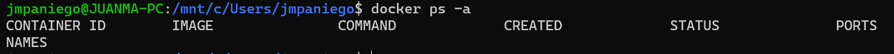
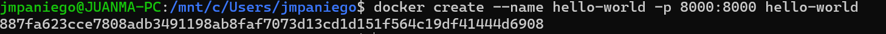
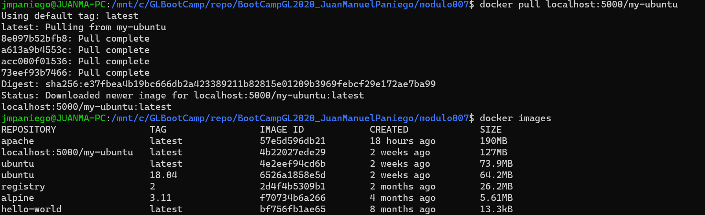

# Introduccion a docker y virtualizacion

## Bandit game
- Paso 1:

- Paso 2:

- Paso 3:

- Paso 4:

- Paso 5:

- Paso 6:

- Paso 7:

- Paso 8:

- Paso 9:

- Paso 10:

- Paso 11:

- Paso 12:

- Paso 13:

## Ejercicios
1. Comandos
  - Verificar la version de docker
    
  - Ver las imagenes del repositorio local
    
  - Ver los contenedores corriendo y los que estan detenidos
    

2. Imagenes
  - Descargar la imagen hello-world en su repositorio
    
  - Ver las imagenes del repositorio local
    
  - Ver los contenedores corriendo y los que estan detenidos
    

3. Contenedores
  - Crear un contenedor a partir de la imagen bajada (hello-world)
    
  - Ver las imagenes del repositorio local}
    
  - Ver los contenedores corriendo y los que estan detenidos
    

4. Dockerfile
  - Crear una imagen con un SO Ubuntu y le vamos a instalar el servidor web Apache, para ello contamos con un Dockerfile que vamos a crear en la siguiente ruta C:\GLBootCamp\repo\docker\apache: 
  

  - Ejercicio: Construir imagen. Indicar a docker que construya una imagen con el nombre apache a partir del DockerFile que se encuentra en la misma ruta donde ejecutamos el comando(C:\GLBootCamp\repo\docker\apache)
  ´´´
  docker build . -t apache
  ´´´
  
  - Crear un contenedor, que llamaremos apache1, mapeando el puerto 80 del contenedor con el 90 de nuestra máquina, a partir de la imagen apache. Para comprobar que todo ha ido bien abrimos un navegador con la url http://localhost:90/
  
  
  

5. Service Registry
  - Implementar un servidor de registro.
    - Utilice un comando como el siguiente para iniciar el contenedor de registro:
    ´´´bash
    $ docker run -d -p 5000: 5000 --restart = always --name registro de registro: 2
    ´´´
    
  - Extraiga la imagen ubuntu: 16.04 de Docker Hub.
    
  - Etiqueta docker ubuntu: 16.04 localhost: 5000 / my-ubuntu hacer PUSH en la imagen en el registro local que se ejecuta en localhost: 5000.
    
    
  - Elimine las imágenes: ubuntu:16.04 y localhost:5000/my-ubuntu almacenadas en caché local, para que pueda probar la extracción de la imagen de su registro.
    
    

6. Volúmenes
  1. Implementar volúmenes.
    - Crear un directorio que contendrá la página web.
    - Crear un fichero index.html con una simple página HTML y ubicarla en directorio creado.
    - Crear imagen a partir de dockerfile (bitnami/apache) y crear el contenedor usando volumen.
      - La opción --mount permite crear el enlace entre el directorio de la máquina virtual y el contenedor.
      - La opción tiene tres argumentos separados por comas pero sin espacios:
        - type=bind,source=ORIGEN-EN-MÁQUINA-VIRTUAL,target=DESTINO-EN-CONTENEDOR.
        

        
  2. Implementar volúmenes.
    - Ingrese al navegador y compruebe que se muestra la página recién creada.
    

7. Service Registry(Github)
  1. Generar token en github.
  2. Copiar token en un fichero. **(TOKEN.txt -> C:\GLBootCamp\repo\docker)**
  3. Autenticacion con token. 
    
    - Utiliza este ejemplo de comando de ingreso, reemplace USERNAME con tu nombre de usuario de GitHub y ~/TOKEN.txt con la ruta de archivo a tu token de acceso personal para GitHub
  4. Publicar un paquete de imagen.
    - Determina el nombre y la ID de la imagen Docker APACHE.
    - Etiquetas la imagen APACHE .
      
    - Publicar la imagen para Github Packages.
    - Respuesta esperada:
      